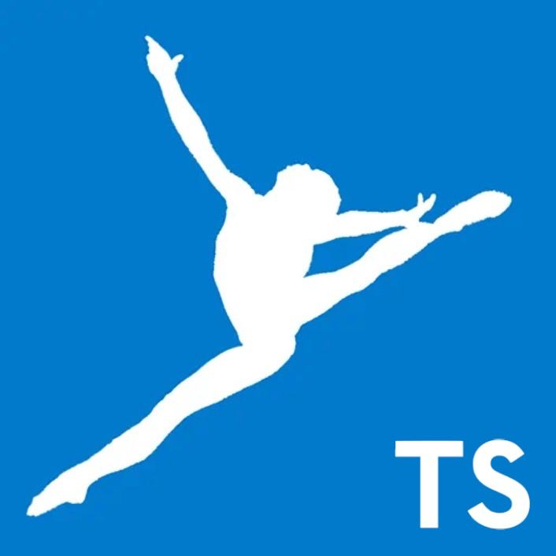

 
  

# TS 类型体操 🤸‍♂️

> Type Challenges 中文解答及分析

[Type Challenges](https://github.com/type-challenges/type-challenges)是一个收录了
许多 TS 类型编程相关题目及解答的库, 本项目旨在对其中的问题做出全面且详细的解答和分析(使用中文!),
同时也是通过费曼学习法来提升自己的能力

## 前置知识 🚩

第 0️⃣ 点, 你需要掌握 js 的基本语法和常用函数

第 1️⃣, 开始挑战前你需要了解 TS 的基本概念, 在此推荐
[菜鸟教程的 TS 基本语法教程](https://www.runoob.com/typescript/ts-tutorial.html).
还需要 TS 编译编辑环境, 推荐使用 VSCode+npm 下载 TS,
亦可[在线运行 TS 代码](https://www.tslang.cn/play/index.html)

其次, 最好先了解一下 TS 的高阶特性, 如泛型, `keyof`, `typeof`, `extend`等.
在此推荐[TS 官网上的英文文档](https://www.typescriptlang.org/docs/handbook/2/types-from-types.html)

接着, 你可以前去[Type Challenges](https://github.com/type-challenges/type-challenges)
官方地址处逛逛, 看看其中的题目及规范等

最后, 参考下方目录结构, `cd ./src`, 开始旅程吧

## 目录结构 🌳

`/src`目录下对每个题目建立了一个文件夹, 命名为`${编号}-${题目名称}-${难度}`, 其中各个文件夹下有两个文件

- `README.md`中依次包含
  - 翻译过的题干
  - 我的解答
  - 详细分析
- `index.ts`中是最小可通过编译的代码, 其中包括
  - 可能存在的前置类型定义
  - 翻译过的题干
  - 题解
  - 测试

## 题目速览 🗺

- [1 hello world, 简单](src/0001-HelloWorld-easy)
- [4 pick, 简单](src/0004-Pick-easy)
- [7 readonly, 简单](src/0007-Readonly-easy)
- [11 tuple to object, 简单](src/0011-TupleToObject-easy)
- [14 first of array, 简单](src/0014-FirstOfArray-easy)
- [18 tuple length, 简单](src/0018-TupleLength-easy)
- [43 exclude, 简单](src/0043-Exclude-easy)
- [189 awaited, 简单](src/0189-Awaited-easy)
- [268 if, 简单](src/0268-If-easy)
- [533 concat, 简单](src/0533-Concat-easy)
- [898 includes, 简单](src/0898-Includes-easy)
- [2 return type, 中等](src/0002-ReturnType-medium)
- [3 omit, 中等](src/0003-Omit-medium)
- [8 readonly2, 中等](src/0008-Readonly2-medium)
- [9 deep readonly, 中等](src/0009-DeepReadonly-medium)
- [10 tuple to union, 中等](src/0010-TupleToUnion-medium)
- [12 chainable options, 中等](src/0012-ChainableOptions-medium)
- [15 last of array, 中等](src/0015-LastOfArray-medium)
- [16 pop, 中等](src/0016-Pop-medium)
- [20 promise all, 中等](src/0020-PromiseAll-medium)
- [62 type lookup, 中等](src/0062-TypeLookup-medium)
- [106 trim left, 中等](src/0106-TrimLeft-medium)
- [108 trim, 中等](src/0108-Trim-medium)
- [110 capitalize, 中等](src/0110-Capitalize-medium)
- [116 replace, 中等](src/0116-Replace-medium)
- [119 replace all, 中等](src/0119-ReplaceAll-medium)
- [191 append argument, 中等](src/0191-AppendArgument-medium)
- [296 permutation, 中等](src/0296-Permutation-medium)
- [298 length of string, 中等](src/0298-LengthOfString-medium)
- [459 flatten, 中等](src/0459-flatten-medium)
- [527 append to object, 中等](src/0527-AppendToObject-medium)
- [529 absolute, 中等](src/0529-Absolute-medium)
- [531 string to union, 中等](src/0531-StringToUnion-medium)
- [599 merge, 中等](src/0599-Merge-medium)
